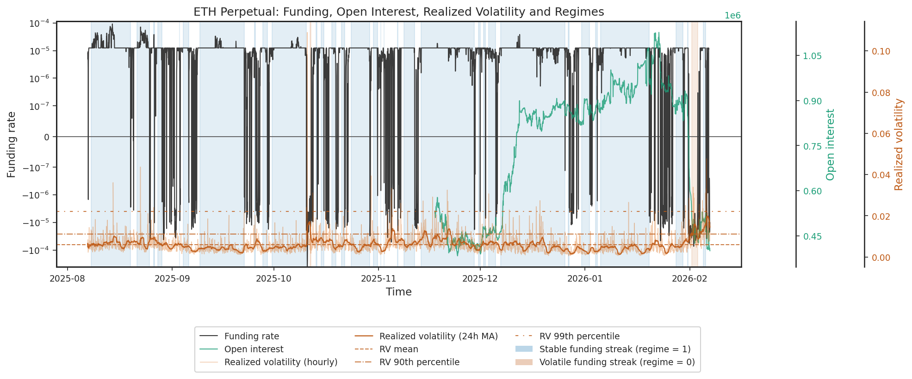

# Funding Regimes in ETH Perpetuals
This project investigates drivers of funding rates in ETH perpetual markets. It tests whether Realized Volatility (RV) explains funding sign, funding magnitude, and regime persistence and whether funding is driven by leverage build-up and positioning imbalance.

## Table of Contents
- [Data](#data)
- [Methodology](#methodology)
- [Results](#results)
- [Next Steps](#next-steps)

## Data
Sample period: 02-07-2025 to 02-01-2026

Frequency: 1-hour aggregation at period close

Sources:
- ETH perpetual funding rates (Hyperliquid)
- ETH perpetual Open Interest (Hyperliquid, 3 months available)
- ETH futures 5min candlesticks (Binance, used as volatility proxy)

Funding_t corresponds to positioning accumulated during [t−1, t].
Binance futures are used as a high-data-availability proxy for volatility estimation. Invariance was verified through Pearson correlation for overlapping period of 60 days with 5-min returns frequency; resulting in a correlation coefficient of >0.99 and p<1e-16.

## Methodology
### 1. Realized Volatility
Log returns computed from 5-minute Binance futures prices.

Hourly realized volatility:

$$
RV_{1h,t} = \sqrt{\sum_{i=1}^{n} r_{t,i}^{2}}
$$

where $r_{t,i}$ are 5-minute log-returns within hour $t$.

24-hour moving average is defined as MA(24) of hourly realized volatility.

### 2. Open Interest

OI measured at hourly close.

### 3. Funding Sign Streaks

Funding rates are classified by sign $s_t=1$ if $f_t > 0$ and $s_t=0$ if $f_t \le 0$.

A funding sign streak is defined based on persistent funding sign over a rolling window of length
$N$. Empirical distribution of observed ETH sample showed a total number of 131 streaks, with median length of 5 hours, mean length of 30.08 hours, min of 1, max of 479, and 25% / 75% / 90% quantiles of 2 / 21 / 53, respectively.

Define the rolling positive and non-positive counts as:

$$
R_t^{(+)} = \sum_{j=0}^{N-1} \mathbf{1}(f_{t-j} > 0)
$$

$$
R_t^{(-)} = \sum_{j=0}^{N-1} \mathbf{1}(f_{t-j} \le 0)
$$

where $\mathbf{1}(\cdot)$ denotes the indicator function.

In the empirical analysis, $N = 21$, corresponding to the 75th percentile of positive funding streak lengths, was chosen. The streak classification is therefore:

$$
\text{Funding Regime}_t =
\begin{cases}
1 & \text{if } R_t^{(+)} = 21 \\
0 & \text{if } R_t^{(-)} = 21 \\
\text{NA} & \text{otherwise}
\end{cases}
$$

## Results

Funding signs correlate weakly, but significantly with RV, which becomes stronger correlated in right-tail volatility regimes. ΔOI has a weak but significant positive correlation with funding signs. RV and ΔOI are practically approximately independent:

| Pair             | Pearson co. | p |
| ------------------ | ----- |---|
| (RV, funding sign)  | -0.16 | <1e-25 |
| (RV MA[24h]>90p, funding sign) | -0.36  | <1e-14 |
| (ΔOI, funding sign) | 0.11  | <1e-6|
| (RV, ΔOI) | -0.04  | 0.08 |

## Next Steps
- Increase data period for OI; use additional invariant series for more data points for RV, funding rates, and OI
- Increase number of variables; order book imbalance, liquidations, order flows
- Use different (possibly smaller) N for negative signed funding streaks
